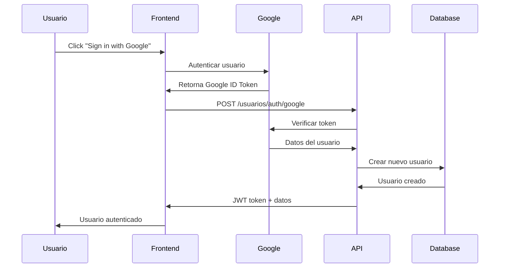
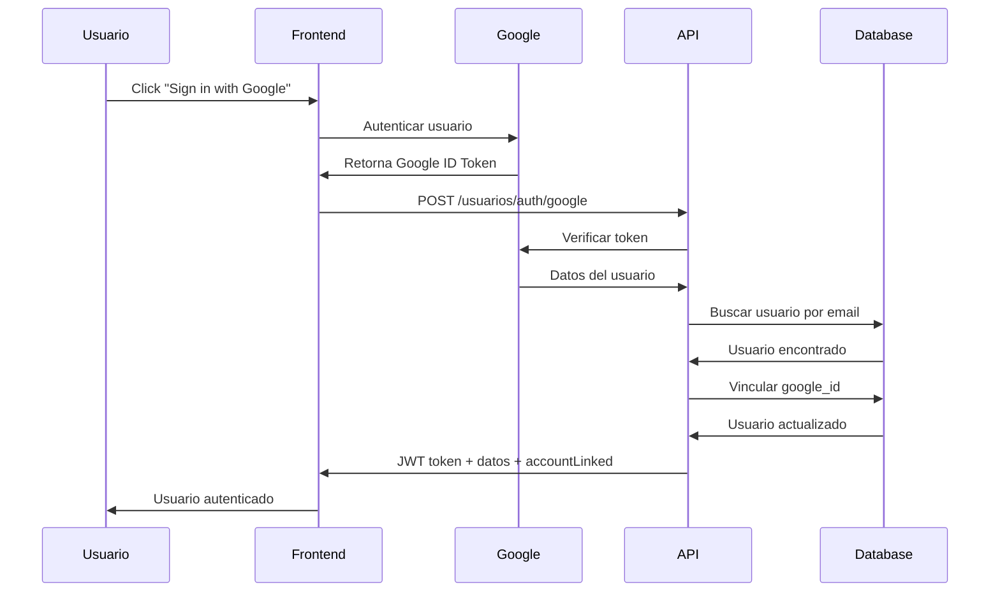

# 🔐 Autenticación con Google OAuth - Omega API

## 📋 Resumen

Se ha implementado exitosamente un sistema de autenticación con Google OAuth 2.0 en la API REST de Omega. Este sistema permite a los usuarios autenticarse usando sus cuentas de Google además del método tradicional de email/contraseña.

## 🚀 Características Implementadas

### ✅ Endpoints Nuevos

1. **POST /usuarios/auth/google** - Autenticación/Registro con Google
2. **DELETE /usuarios/auth/google/unlink** - Desvincular cuenta de Google

### ✅ Funcionalidades

- **Registro automático**: Usuarios nuevos se registran automáticamente con Google
- **Vinculación de cuentas**: Usuarios existentes pueden vincular su cuenta con Google
- **Autenticación única**: Mismo sistema JWT para ambos métodos
- **Desvinculación segura**: Opción para desvincular Google (requiere contraseña establecida)
- **Gestión de roles**: Mantiene el sistema de roles existente

### ✅ Base de Datos

- Nueva columna `google_id` en tabla `usuarios`
- Restricción UNIQUE para evitar duplicados
- Índice optimizado para búsquedas
- Contraseña opcional para usuarios de Google

## 📂 Archivos Creados/Modificados

```
📁 middleware/
  └── googleAuth.js              # Middleware para verificación de tokens Google

📁 scripts/
  ├── configurar_google_oauth.js # Script para configurar BD
  └── agregar_google_oauth.sql   # Script SQL alternativo

📁 frontend-google-auth/
  └── index.html                 # Ejemplo de frontend con Google Sign-In

📁 models/
  └── usuariosModel.js          # ➕ Métodos para Google OAuth

📁 controllers/
  └── usuariosController.js     # ➕ Controladores para Google OAuth

📁 routes/
  └── usuariosRoutes.js         # ➕ Rutas para Google OAuth

📄 test_google_auth.js          # Pruebas de endpoints
📄 .env                         # ➕ Variables de entorno para Google
```

## 🛠️ Configuración Requerida

### 1. Variables de Entorno (.env)

```bash
# Google OAuth Configuration
GOOGLE_CLIENT_ID=tu_google_client_id_aqui
GOOGLE_CLIENT_SECRET=tu_google_client_secret_aqui  # Opcional
```

### 2. Obtener Credenciales de Google

1. Ve a [Google Cloud Console](https://console.cloud.google.com/)
2. Crea un nuevo proyecto o selecciona uno existente
3. Habilita la "Google+ API" o "Google Sign-In API"
4. Ve a "Credenciales" → "Crear credenciales" → "ID de cliente OAuth 2.0"
5. Configura los orígenes autorizados:
   - `http://localhost:4000` (para desarrollo)
   - `https://tu-dominio.com` (para producción)
6. Copia el `Client ID` y `Client Secret`

## 📊 Estructura de Base de Datos

### Tabla `usuarios` - Nuevos Campos

```sql
-- Nueva columna agregada
google_id VARCHAR(255) UNIQUE  -- ID único de Google OAuth
```

### Modificaciones

```sql
-- Contraseña ahora es opcional (para usuarios de Google)
ALTER TABLE usuarios ALTER COLUMN contrasena DROP NOT NULL;

-- Índice para búsquedas rápidas
CREATE INDEX idx_usuarios_google_id ON usuarios(google_id);
```

## 🔗 API Endpoints

### 1. POST `/usuarios/auth/google`

Autentica o registra un usuario usando Google OAuth.

**Request:**
```json
{
  "googleToken": "eyJhbGciOiJSUzI1NiIsImtpZCI6..."
}
```

**Response (Usuario nuevo):**
```json
{
  "token": "jwt_token_aqui",
  "nombre": "Juan",
  "apellido_paterno": "Pérez",
  "apellido_materno": "García",
  "foto_perfil_url": "https://lh3.googleusercontent.com/...",
  "rol_id": 1,
  "loginMethod": "google",
  "newUser": true
}
```

**Response (Usuario existente):**
```json
{
  "token": "jwt_token_aqui",
  "nombre": "Juan",
  "apellido_paterno": "Pérez",
  "apellido_materno": "García",
  "foto_perfil_url": "http://localhost:4000/uploads/...",
  "rol_id": 1,
  "loginMethod": "google"
}
```

**Response (Cuenta vinculada):**
```json
{
  "token": "jwt_token_aqui",
  "nombre": "Juan",
  "apellido_paterno": "Pérez",
  "apellido_materno": "García",
  "foto_perfil_url": "http://localhost:4000/uploads/...",
  "rol_id": 1,
  "loginMethod": "google",
  "accountLinked": true
}
```

### 2. DELETE `/usuarios/auth/google/unlink`

Desvincula la cuenta de Google del usuario autenticado.

**Headers:**
```
Authorization: Bearer jwt_token_aqui
```

**Response:**
```json
{
  "message": "Cuenta de Google desvinculada exitosamente."
}
```

**Error (sin contraseña):**
```json
{
  "message": "No puedes desvincular Google sin establecer una contraseña primero.",
  "requirePassword": true
}
```

## 🌐 Integración Frontend

### Ejemplo con Google Sign-In JavaScript

```html
<!-- Cargar la librería de Google -->
<script src="https://accounts.google.com/gsi/client" async defer></script>

<!-- Configurar el botón -->
<div id="g_id_onload"
     data-client_id="TU_GOOGLE_CLIENT_ID"
     data-callback="handleCredentialResponse">
</div>

<div class="g_id_signin" data-type="standard"></div>

<script>
function handleCredentialResponse(response) {
  // Enviar token a tu API
  fetch('http://localhost:4000/usuarios/auth/google', {
    method: 'POST',
    headers: { 'Content-Type': 'application/json' },
    body: JSON.stringify({ googleToken: response.credential })
  })
  .then(res => res.json())
  .then(data => {
    // Guardar JWT token
    localStorage.setItem('token', data.token);
    // Redirigir o actualizar UI
    window.location.href = '/dashboard';
  });
}
</script>
```

## 🧪 Pruebas

### Ejecutar Pruebas Automáticas

```bash
# Asegúrate de que el servidor esté corriendo
npm start

# En otra terminal, ejecuta las pruebas
node test_google_auth.js
```

### Pruebas con Frontend

1. Abre `frontend-google-auth/index.html` en tu navegador
2. Configura tu `GOOGLE_CLIENT_ID` en el HTML
3. Prueba la autenticación con Google y tradicional

### Pruebas con cURL

```bash
# Ejemplo (requiere token real de Google)
curl -X POST http://localhost:4000/usuarios/auth/google \
  -H "Content-Type: application/json" \
  -d '{"googleToken":"TOKEN_REAL_DE_GOOGLE"}'

# Desvincular Google
curl -X DELETE http://localhost:4000/usuarios/auth/google/unlink \
  -H "Authorization: Bearer TU_JWT_TOKEN"
```

## 🔄 Flujos de Autenticación

### Flujo 1: Usuario Nuevo con Google



### Flujo 2: Usuario Existente (Vinculación)



## 🔒 Seguridad

### Validaciones Implementadas

- ✅ Verificación de tokens Google con Google Auth Library
- ✅ Validación de audience (Client ID)
- ✅ Generación segura de JWT tokens
- ✅ Restricción UNIQUE en google_id
- ✅ Auditoría de eventos de autenticación

### Mejores Prácticas

- 🔐 Siempre verifica tokens en el backend
- 🔄 Implementa refresh tokens para sesiones largas
- 📝 Registra eventos de autenticación para auditoría
- 🚫 No confíes en validaciones del frontend únicamente

## 📈 Monitoreo y Logs

El sistema registra automáticamente en auditoría:

- `registro con Google` - Nuevo usuario registrado
- `inicio de sesión con Google` - Usuario existente inicia sesión
- `vinculación de cuenta Google` - Cuenta tradicional vinculada
- `desvinculación de Google` - Cuenta Google desvinculada

## 🔧 Mantenimiento

### Comandos Útiles

```bash
# Reinstalar dependencias
npm install google-auth-library passport passport-google-oauth20

# Reconfigurar base de datos
node scripts/configurar_google_oauth.js

# Verificar estructura de BD
psql -d postgres -c "\d usuarios"

# Ver usuarios con Google
psql -d postgres -c "SELECT usuario_id, nombre, correo_electronico, google_id FROM usuarios WHERE google_id IS NOT NULL;"
```

## 🐛 Resolución de Problemas

### Error: "Token de Google inválido"

- ✅ Verifica que `GOOGLE_CLIENT_ID` sea correcto
- ✅ Asegúrate de usar un token ID real, no uno de ejemplo
- ✅ Verifica que el token no haya expirado

### Error: "No se pudo conectar con el servidor"

- ✅ Verifica que el servidor esté ejecutándose en puerto 4000
- ✅ Revisa que no haya conflictos de CORS
- ✅ Asegúrate de que las rutas estén configuradas correctamente

### Error en Base de Datos

```bash
# Si hay problemas con la BD, ejecuta:
node scripts/configurar_google_oauth.js
```

## 📚 Recursos Adicionales

- [Google Sign-In for Web](https://developers.google.com/identity/sign-in/web)
- [Google Auth Library for Node.js](https://github.com/googleapis/google-auth-library-nodejs)
- [JWT.io - Debugger](https://jwt.io/)
- [Documentación oficial de OAuth 2.0](https://oauth.net/2/)

---

## ✅ Estado del Proyecto

**✅ COMPLETADO**: Sistema de autenticación con Google OAuth funcional
- ✅ Base de datos configurada
- ✅ Endpoints implementados
- ✅ Middleware de seguridad
- ✅ Pruebas básicas
- ✅ Documentación completa
- ✅ Ejemplo de frontend

**⏳ PRÓXIMOS PASOS**:
1. Configurar credenciales reales de Google
2. Implementar frontend en producción
3. Configurar dominio de producción en Google Console
4. Implementar refresh tokens (opcional)
5. Agregar más proveedores OAuth (Facebook, GitHub, etc.)

El sistema está listo para usar en desarrollo y producción. Solo necesita configurar las credenciales de Google Cloud Console.
